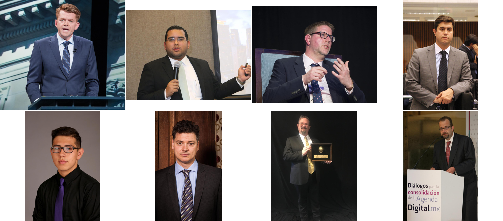
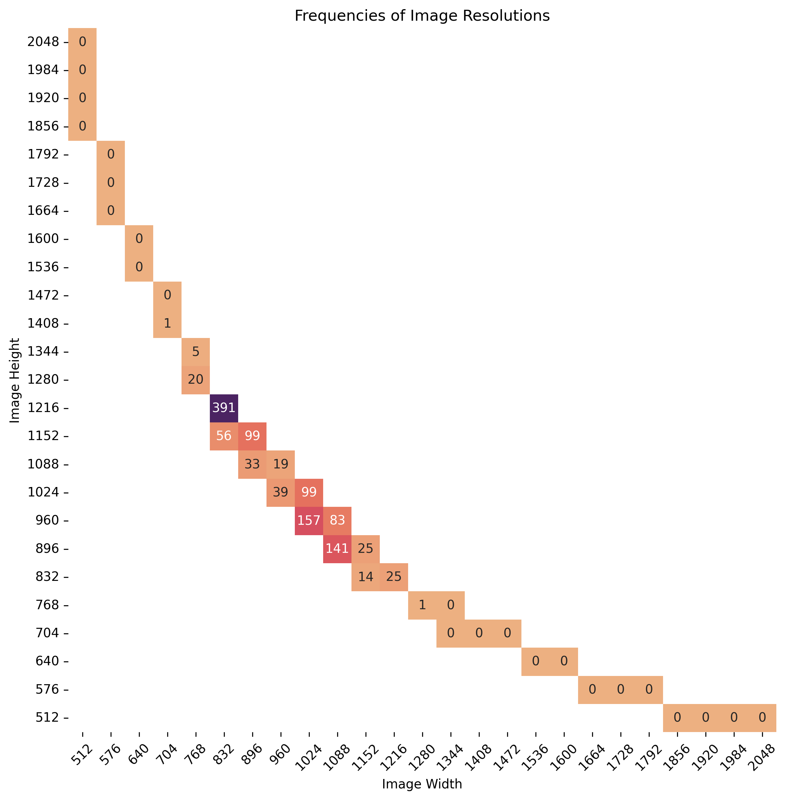

# Flickr-Suits-XL Dataset (FSXL) 

The Flickr-Suits-XL Dataset (FSXL) contains images of people wearing suits. 

The image resolutions are the same as [SDXL](https://arxiv.org/abs/2307.01952) as indicated in Appendix I. 

The subjects are mostly male. 

## Image Resolutions

## Licenses

The individual images were published in Flickr by their respective authors under either [Creative Commons BY 2.0](https://creativecommons.org/licenses/by/2.0/), [Creative Commons BY-NC 2.0](https://creativecommons.org/licenses/by-nc/2.0/), [Public Domain Mark 1.0](https://creativecommons.org/publicdomain/mark/1.0/), [Public Domain CC0 1.0](https://creativecommons.org/publicdomain/zero/1.0/), or [U.S. Government Works](http://www.usa.gov/copyright.shtml) license. All of these licenses allow **free use, redistribution, and adaptation for non-commercial purposes**. However, some of them require giving **appropriate credit** to the original author, as well as **indicating any changes** that were made to the images. The license and original author of each image are indicated in the metadata.

* [https://creativecommons.org/licenses/by/2.0/](https://creativecommons.org/licenses/by/2.0/)
* [https://creativecommons.org/licenses/by-nc/2.0/](https://creativecommons.org/licenses/by-nc/2.0/)
* [https://creativecommons.org/publicdomain/mark/1.0/](https://creativecommons.org/publicdomain/mark/1.0/)
* [https://creativecommons.org/publicdomain/zero/1.0/](https://creativecommons.org/publicdomain/zero/1.0/)
* [http://www.usa.gov/copyright.shtml](http://www.usa.gov/copyright.shtml)

The dataset itself is made available under [Creative Commons BY-NC-SA 4.0](https://creativecommons.org/licenses/by-nc-sa/4.0/). You can **use, redistribute, and adapt it for non-commercial purposes**, as long as you (a) **indicate any changes** that you've made, and (b) distribute any derivative works **under the same license**.

* [https://creativecommons.org/licenses/by-nc-sa/4.0/](https://creativecommons.org/licenses/by-nc-sa/4.0/)

This decision was made because [Creative Commons CC BY-NC 2.0](https://creativecommons.org/licenses/by-nc/2.0/) restricts the commercial use.
