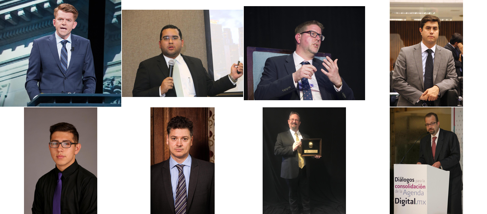
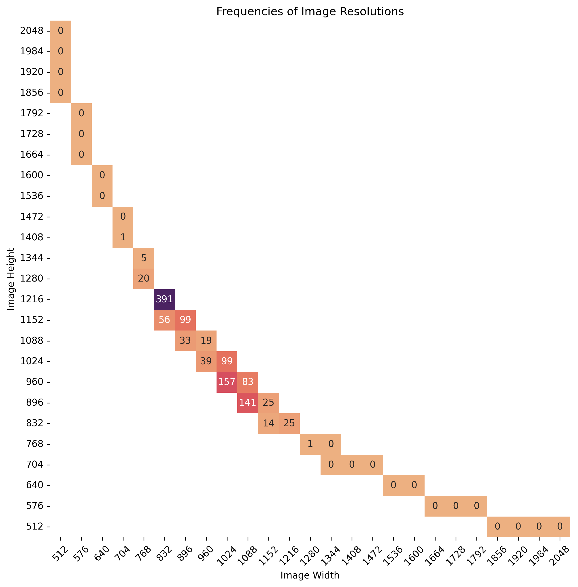

# Flickr-Suits-XL Dataset (FSXL)




The **Flickr-Suits-XL (FSXL)** dataset provides **1208 high-quality portrait images** of individuals wearing suits. This dataset is ideal for **computer vision research**, especially in areas like **facial recognition, portrait generation, and synthetic data augmentation**.

Images were sourced from Flickr under permissive licenses. The curation process involved:
- Crawling **5687 images** from Flickr.
- Filtering using **MTCNN face detection**.
- Performing face alignment.
- Cropping images to center the face horizontally and position it at approximately **1/3 from the top vertically**.
- Standardizing image resolutions to match the **SDXL model specifications (~1 megapixel)**.

> 📌 **Note**: The dataset exhibits a **gender imbalance**, with **male subjects being the majority**.

---

## Metadata

Detailed metadata for each image is available in the file: [fsxl-metadata.json](fsxl-metadata.json).

Example entry:

```json
[
    {
        "image_name": "20716603320.jpg",
        "photo_url": "https://www.flickr.com/photos/35591378@N03/20716603320",
        "photo_title": "P040915PS-0974",
        "author": "Obama White House Archived",
        "country": "",
        "license": "United States Government Work",
        "license_url": "http://www.usa.gov/copyright.shtml",
        "date_uploaded": "2015-08-26",
        "date_crawled": "2024-07-19"
    }
]
```

---

## Image Resolutions

All images are processed to match **SDXL training specifications** (~1MP):



---

## Citation (BibTeX)

If you use the FSXL dataset in your research, please cite:

```bibtex
@inproceedings{Ulusan2025SynData4CV,  
  author        = {Ulusan, Koray and Kiefer, Benjamin},
  title         = {{Generating Synthetic Data via Augmentations for Improved Facial Resemblance in DreamBooth and InstantID}},
  booktitle     = {Proceedings of the CVPR 2025 Workshop on Synthetic Data for Computer Vision (SynData4CV)},
  year          = {2025},
  month         = {May},
  url           = {https://openreview.net/forum?id=2o0RxrcV23},
  note          = {Accepted to the CVPR 2025 SynData4CV Workshop},
  eprint        = {2505.03557},
  archiveprefix = {arXiv},
  primaryclass  = {cs.CV},
  doi           = {10.48550/arXiv.2505.03557}
}
```

---

## Licenses

The individual images are published under the following licenses:
- [Creative Commons BY 2.0](https://creativecommons.org/licenses/by/2.0/)
- [Creative Commons BY-NC 2.0](https://creativecommons.org/licenses/by-nc/2.0/)
- [Public Domain Mark 1.0](https://creativecommons.org/publicdomain/mark/1.0/)
- [Public Domain CC0 1.0](https://creativecommons.org/publicdomain/zero/1.0/)
- [U.S. Government Works](http://www.usa.gov/copyright.shtml)

All these licenses permit **free use, redistribution, and adaptation for non-commercial purposes**, provided that:
- **Credit is attributed** to the original author.
- **Modifications are disclosed**.

### Dataset License

The FSXL dataset itself is released under the [Creative Commons BY-NC-SA 4.0](https://creativecommons.org/licenses/by-nc-sa/4.0/) license:
- ✅ **Non-commercial use only**
- ✅ **Attribution required**
- ✅ **Share derivatives under the same license**

This ensures ethical and responsible use while maintaining openness for academic and research purposes.
